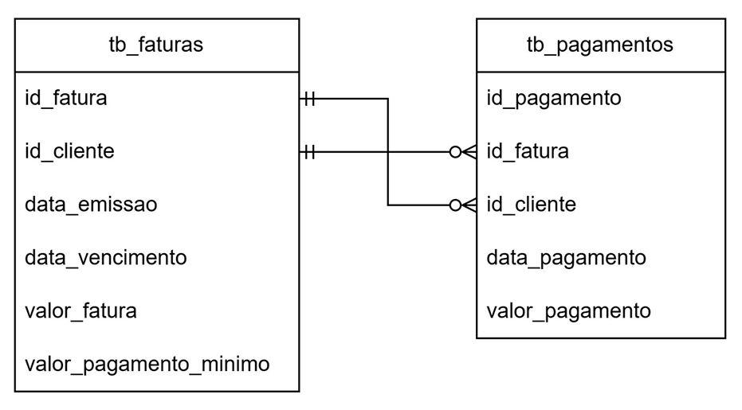
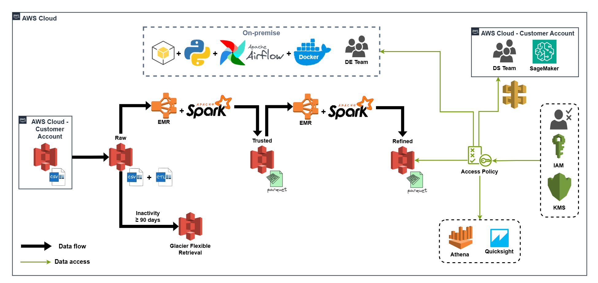
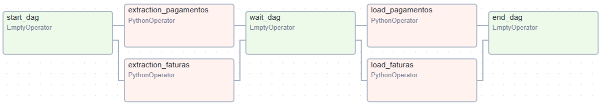
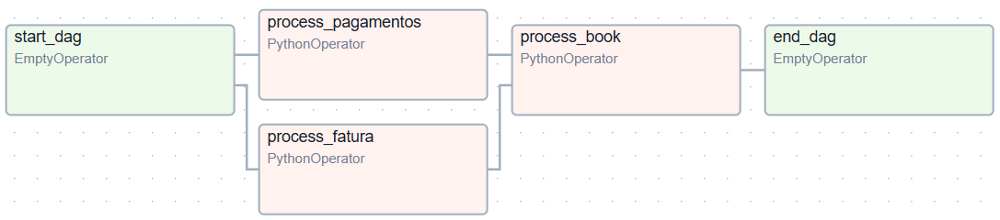
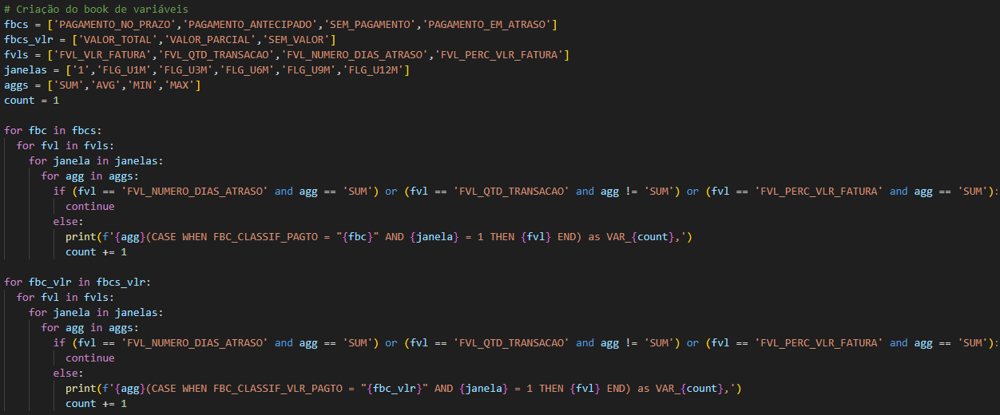

# data_lake_aws

> Author: Danilo Machado

## Introdução

A soluções para atender as necessidades de cada empresa podem variar muito de uma empresa para outra. A arquitetura
de dados escolhida, por exemplo, pode impactar desde o armazenamento dos dados até a última camada de consumo desses dados.
Problemas assim não só podem gerar custos excessivos, como podem comprometer o faturamento e as estretégias de negócio.

Neste projeto, com fins didáticos, uma empresa financeira fictícia (com dados fictícios) chamada PoD Cartões está enfrentando
alguns desafios em seu ambiente de dados. Entre os problemas, temos:

- Armazenamento dos dados: dados de clientes, transações e comportamento estão fragmentados em diferentes sistemas, dificultando
a consolidação e a confiabilidade;
- Suporte às operações: ineficiência da estrutra atual para lidar com o volume, variedade e velocidade dos dados gerados pelas
operações, impactando a escalabilidade e a agilidade.
- Capacitação para modelagem preditiva: o time de cientistas de dados tem dificuldades para acessar e consumir os dados, limitando
o desenvolvimento de modelos analíticos e preditivos que poderiam auxiliar na retenção de clientes, previsão de inadimplência e
personalização de ofertas.

Os dados fornecidos pela empresa são provenientes de duas tabelas, uma de faturas e uma de pagamentos, como mostra o diagrama de
entidade-relacionamento a seguir:

O diagrama mostra as relações entre id_fatura, id_cliente e id_pagamentos. Na tabela tb_pagamentos, cada id_fatura tem cardinalidade
1:1 com id_cliente na tabela tb_fatura, e cada id_cliente tem cardinalidade 1:1 com id_fatura na tb_fatura. Porém, na tb_fatura, cada
id_fatura tem uma relação 0:N com id_cliente na tb_pagamentos, porque uma fatura pode ou não ter pagamento. O mesmo para id_cliente na
tb_fatura e id_fatura com id_cliente na tb_pagamentos.

## Objetivos

Com base nos desafios que a empresa vem enfrentando, este projeto teve como objetivo implementar um Data Lake para a empresa,
garantindo:

- Escalabilidade do armazenamento e das operações, tanto para dados estruturados, como não estruturados;
- Centralização, confiabilidade e assebilidade para os departamentos da empresa tomarem decisões data driven;
- Suporte ao time de ciência de dados com a criação de um book de variáveis de fatura na visão mensal, olhando
para os últimos 12 meses a partir de uma data de referência.

## Dependências do projeto

- [Python 3.13](https://www.python.org)
- [Docker](https://docs.docker.com/)
- [Apache Airflow](https://airflow.apache.org/docs/)

O Python foi usado com VSCode e, com o Docker instalado, o Apache Airflow foi instalado a partir do arquivo
docker-compose.yaml, seguindo as instruções da documentação. 

## Bibliotecas

- os
- pandas
- pyspark
- boto3
- configparser
- datetime
- time

## Serviões e recursos da AWS

| Serviço         | Recurso                           | Descrição                                     |
| --------------- | --------------------------------- | --------------------------------------------- |
| **IAM**         | Políticas e regras de acesso      | Usuário programático e regras para EC2 e EMR  |
| **S3**          | Data Lake Bucket                  | Armazenamento dos dados                       |
| **EMR**         | Clusters                          | Cluster para processamento dos dados          |

As regras e políticas do IAM foram definidas diretamente no console da AWS. Para o EC2 e o EMR, foram criadas as roles
EMR_DefaultRole e a EMR_EC2_DefaultRole.

## Arquitetura do projeto

A arquitetura do projeto dentro da AWS foi pensada da seguinte forma:

## Execução do projeto

As etapas de execução do projeto foram orquestradas pelo Apache Airflow. Para isto, foi criado o script **malha_operator.py**, 
que contém 4 classes: MalhaExtractionOperator, MalhaLoadOperator, MalhaProcessOperator e MalhaBookOperator. Cada um destas classes 
contém métodos para executar alguma tarefa e interagir com os serviçoes da AWS. As duas primeiras foram instaciadas dentro da DAG 
**malha_ingestion.py** e as duas últimas foram instanciadas dentro da DAG **malha_process.py**, ambas localizadas dentro da pasta
dags do projeto.

A figura a seguir apresenta o diagrama de execução da dag **malha_ingestion.py**. Inicialmente, esta DAG lista os arquivos presentes
dentro de um bucket S3 da empresa com acesso programático fornecido por ela. Os arquivos encontrados são, então, baixados e salvos na
pasta de arquivos temporários do Airflow, a pasta /tmp/. A tarefa seguinte lê os nomes desses arquivos e cria arquivos de controle com
o mesmo nome, apenas mudando o extensão .csv para .ctl. Esses arquivos de controle são DataFrames vazios criados dentro do mesmo método.
Por fim, esta DAG carrega os arquivos de dados e os arquivos de controle criados para a camada Raw do Data Lake, divindo-os por assunto 
(faturas e pagamentos).

Como se tratam de dados mensais, o **schedule_interval** desta DAG foi estabelecido para extrair e carregar os dados todo dia 1 de 
cada mês às 8h da manhã.

Uma vez que os dados foram salvos na camada Raw, a DAG **malha_datalake.py** entra em ação. Nesta, o **schedule_interval** foi definido 
para ser executada todo dia 5 de cada mês às 8h da manhã. Essa diferença é pensada para que, caso haja algum problema com a ingestão e 
carregamento dos dados, o engenheiro de dados tenha tempo de corrigir até a execução desta DAG. O diagrama de execução desta segunda 
DAG é apresentado na imagem a seguir:

Inicialmente, esta DAG faz a verificação da existência de arquivos de controle para os assuntos faturas e pagamentos. Caso existam arquivos
de controle, os métodos vão subir um cluster EMR e adicionar step jobs dados pelos scripts **tb_faturas_process** e **tb_pagamentos_process**, 
que podem ser visualizados na pasta src deste projeto. Estes step jobs fazem a leitura dos arquivos tb_faturas e tb_pagamentos e aplicam 
algumas transformações, como padronização das colunas, tipagem e correções necessárias de formatação. Nesta etapa também são criadas colunas auxiliares,
como a coluna ref (AnoMês da data de emissão das faturas) e dt_proc (AnoMêsDiaHoraMinutoSegundo no momento do execução dos scripts).
Para fins de controle e observabilidade do processo, esses scripts de step job possuem alguns prints estratégicos, como número de registros atrelado 
ao dt_proc, schema das tabelas e pequenas visualizações das tabelas para verificação da aplicação das transformações.

Uma vez que esses dados são salvos na camada Trusted, a DAG passa para a próxima tarefa que o processamento do book de variáveis. Para
isto, um novo cluster é criado com um step job adicionado dado pelo script **dedup_stage_book.py**. Este step job vai verificar duplicação dos
dados e em seguida vai fazer um JOIN entre as tabelas tb_faturas e tb_pagamentos para iniciar a preparação para o book de variáveis.

A preparação para o book de variáveis envolve algumas etapas. Após o JOIN entre as tabelas de faturas e de pagamentos, inicia-se o processo
de criar algumas classificações com relação ao comportamento dos clientes da empresa em relação ao pagamento das faturas. Do ponto de vista
da data de vencimento, foram criadas classificações para mostrar se o pagamento foi no prazo, antecipado, atrasado ou se ainda está em aberto. Além
disso, foi criada também uma coluna que conta os dias de atraso, considerando 0 para pagamento no prazo e -1 para pagamento adiantado.
Em relação ao valor do pagamento, foram criadas classificações para mostrar se os pagamentos são valores totais ao parciais referentes ao valor das
respectivas faturas. E neste caso, foi criada uma coluna indicando o percentual pago em relação ao valor total da fatura.

Para obter uma visão mensal, foram criadas também janelas de tempo, com flags que identificam os comportamentos descritos acima ao longo do último mês, 
dos últimos 3 meses, dos últimos 6 meses, dos últimos 9 meses e dos últimos 12 meses. E todas essas informações foram unificadss em uma tabela para serem
serem acessadas a agregadas a usando uma query com spark.sql, como mostra a imagem a seguir:

## Conclusões

Neste projeto implementamos uma solução para uma empresa financeira, aplicando uma arquitetura do tipo Data Lake. Com esta solução, foi possível
contornar os desafios que vinham sendo enfrentados pela empresa. Com armazenamento em camadas no S3, com tratamento adequado dos dados e com processamento
através de clusters EMR, pudemos garantir a escalabilidade, a confiabilidade e a governança dos dados, para que estes possam ser consumidos pelos cientistas e
demais departamentos da empresa sem problemas.
